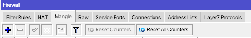
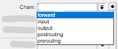
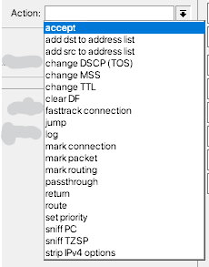
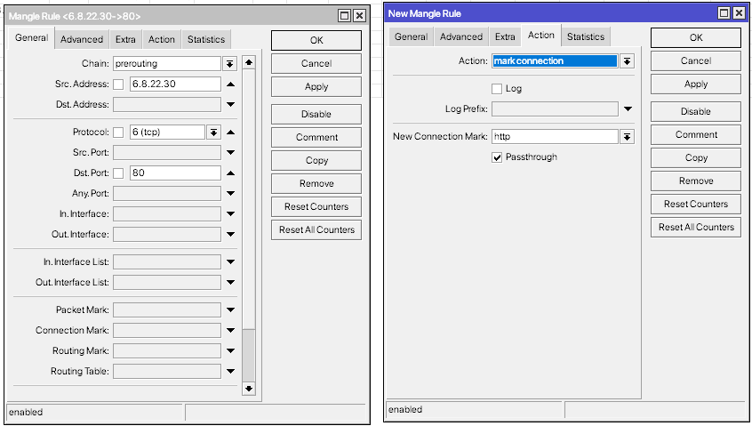
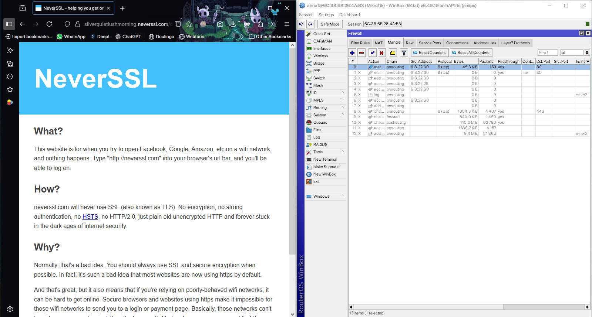
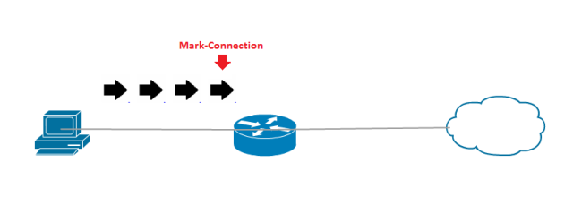
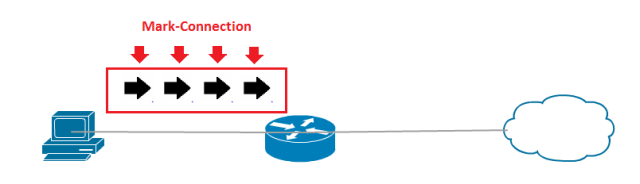
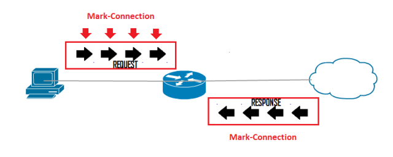
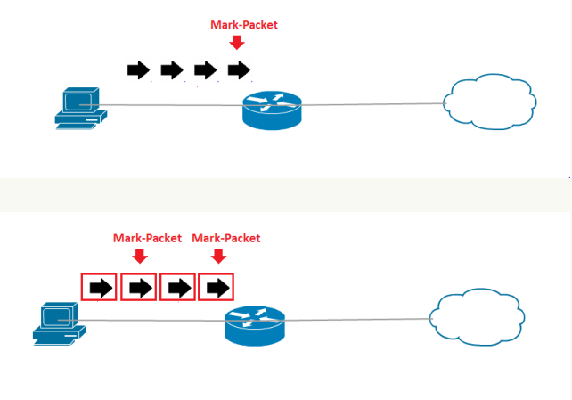

# LAB-46-Firewall-Mangle
Kamis 28 Agustus 2025  
  
# Mangle
  
  FIrewall mangle digunakan untuk menandai sebuah koneksi atau paket dengan tanda khusus untuk pemrosesan selanjutnya, yang mana biasanya mark ini digunakan pada fitur lainnya seperti routing, mark ini hanya bekerja di dalam router untuk di proses dan juga dengan mangle admin dapat mengubah IP header pada paket yang ditentukan. Fitur Mangle ini hanya bisa digunakan pada router MikroTik itu sendiri dan tidak dapat digunakan oleh router lain. Karna karking tersebut akan dilepas pada saat paket data akan keluar / meninggalkan router.  
  
# Chain
  
  1. Prerouting, untuk traffic yang masuk dan melewati router, tidak bisa memilih out interface. Berlaku untuk paket yang baru saja tiba di interface jaringan.  
  2. Forward, untuk traffic yang melewati router.  
  3. Postrouting, untuk traffic yang keluar dan melewati router, tidak bisa memilih in interface. BErlaku untuk paket yang hanya meninggalkan interface jaringan
  4. Input, Untuk traffic yang menuju router, tidak bisa memilih out interface. BErlaku untuk paket apapun yang dirutekan melalui host saat ini.  
  5. Output, Untuk traffic yang keluar dari router, tidak bisa memilih in interface. Berlaku untuk paket apapun yang dirutekan melalui host saat ini.  
  
# Action
  
1. accept  
   Menerima paket, tidak akan diproses pada rule berikutnya.  
2. add dst to address list  
   Untuk menambah informasi dst address dari paket ke address list yang ditentukan.  
3. add src to address list  
   Menambahkan informasi src address dari paket ke address list yang ditentukan.  
4. change DSCP (TOS)  
   Mengubah parameter Type of Service of Diffserv (TOS) oada keader sebuah paker.  
5. change MSS  
   Mengubah parameter MSS (Maximum Segmen Size) pada header sebuah paket, biasanya diterapkan pada koneksi VPN.  
6. change TTL  
   mengubah parameter TTL (Time To Live) pada header sebuah paket  
7. Clear DF
   Menghapus flag DF agar paket bisa di fragmentasi.  
9. Fasttrack connection  
   Untuk mempercepat pemrosesan paket, bypass paket di rule selanjutnya.  
10. jump  
   Paket akan dilempat ke chain yang ditentukan  
11. log  
    Menampilkan informasi di log system.  
12. passthrought  
    meneruskan ke rule dibawahnya  
13. return  
    Mengembalikam ke chain sebelumnya yang menerapkan jump  
14. route  
    memaksa paket ke IP gateway tertentu, tidak akan di proses pada routing decision, hanya pada chain prerouting.  
15. set priority  
    Untuk mengatur prioritas paket.  
16. sniff PC  
    Untuk mengirim paket ke CALEA server  
17. sniff TZSP  
    Kirim paket ke Wireshark/TZSP server  
18. strip ipv4 options  
    Menghapus opsi IPv4  
  
# Marking
  
1. mark connection  
    Untuk menandai setiap paket yang melewati router dan juga menandai traffic request maupun response. Mark ini akan menandai paket yang pertama lewat kemudian semua packet yang satu koneksi dengan packet pertama akan mendapat marking yang sama. Karna packet belakangnya pasti mengikuti yang depan, maka COnnection mark ini hanya membutuhkan sedikit Resource dari RouterBoard.  
  
Marking di Packet yang pertama.  
  
Mark COnnection akan menandai packet pertama yang melewati router kemudian paket dibelakangnya akan menerima tanda yang sama. Mark ini akan menandai packet Request dan Response, maka secara otomatis paket Response dari internet juga akan mendapat marking yang sama.  
  
  Contoh Penggunaan:  
Kita akan melakukan marking sesuai dengan konten yang diakses user. Misalnya melakukan connection marking pada content file berekstensi *.rar.  
  
Keterangan:  
- Chain=prerouting, chain yang digunakan untuk melakukan marking pada paket yang akan keluar dari router.  
- src-address, sumber yang mengeluarkan paket.  
- protocol=tcp port=8-, karena kita akan melakukan marking pada aktifitas HTTP, maka mengunakan protocol TCP dan 80.  
- in-interface=ether2, masuk memalui ether2  
- action=mark-connection, untuk menandai koneksi  
- new-connection-mark=browsing, nama  
  Untuk melakukan pengecekan, bisa kita lihat pada menu IP > Firewall > Mangle­ lalu lihat di bagian Packets. Setelah itu, kita test melakukan browsing, misalnya membuka website neverssl.com.  
  
Bisa kita lihat dipagian packets, PC Client membuat beberapa koneksi saat membuka website tersebut digunakan untuk membuka content misalny gambar atau link pada website tersebut.  
3. mark packet  
    Untuk menandai 1 koneksi baik itu untuk request maupun response. Atau menandai setiap packet yang melewati router. Jadi kita akan terus bertanya kepada packet yang lewat dan menandainya satu-persatu.  
  
4. mark routing  
    Digunakan untuk pemilihan jalur routing, semisal kita mengunakan 2 ISP maka kita bisa menentukan ISP mana yang akan digunakan setiap client mengunakan marking ini.  
